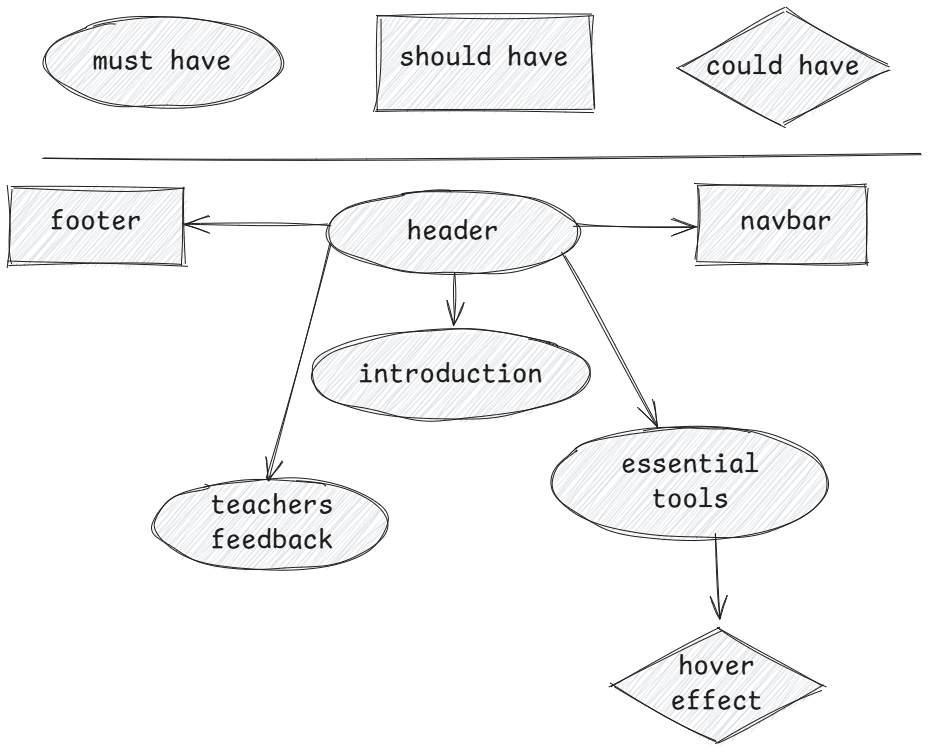

# Backlog - Teachers Page

## Must Haves

> these are necessary for basic usability

### Header

- As a teacher, I can see the header so I can view the logo
- [ ] there is a logo at the top of the page

### Introduction

- As a teacher, I can see the title, description, and call to action button so I
  can view a small brief about the platform
- [ ] there is a title at the top of the section
- [ ] there is a short description (2-3) lines about the
- [ ] there is button to start using the platform

### Essential tools

- As a teacher, I can see provided services so that I can know the services I
  can use.

  - [ ] there is cards for every service

### Teachers feedback

- As a teacher, I want to see what other teachers feedback so that I can be
  confident in my choice this analytic tool.
  - [ ] _there is a list of user feedback card that contain teacher name, image
        and their feedback_

## Should-Haves

> will complete the user experience, but are not necessary

### Navbar

- As a teacher, I can navigate to different sections in the page so I can access
  to the sections easily.
  - [ ] There is a navbar at the top of the page with links to the different
        sections.

### Footer

- As a teacher, I can contact with customer service so that I can reach them
  out.
  - [ ] there is a footer with contact info

## Could-Haves

> would be really cool ... if there's time

### Hover effect

- As a teacher, I can hover on tools for smooth effects.
  - [ ] there is a hover effect on every tool in essential tools section.

## Story Sequencing

