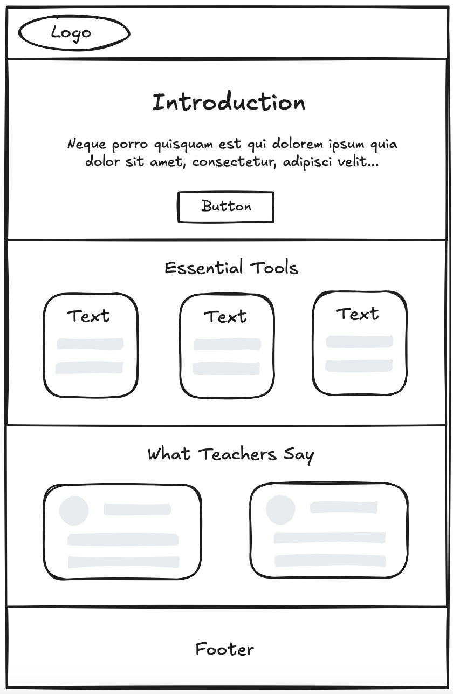

# Design

## Project's design overview

> The page design is complementing PostHog’s existing visual style, while making
> it easy for teachers to understand PostHog’s tools for tracking student
> engagement and performance.

<!-- give an overview of your project's design -->
<!-- describe the reasoning behind your group's design and wireframe -->
<!-- include other centralized decisions like fonts, palates, ... -->

---

## Wireframe(s)

<!-- provide a link to your wireframe documenting on Figma, or wherever it is -->

## Colors

- Primary: #ff5c5c;
- Secondary: #1d1f24;
- Accent: #fefefe;
- Highlight: #f9a826;

## Typography

- Font Family:
  [Lexend](https://fonts.googleapis.com/css2?family=Lexend&display=swap)
- Font Weight: 400
